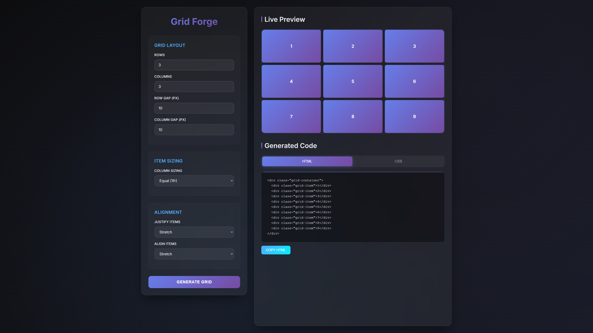

# 🌐 Modern CSS Grid Generator

An interactive and beautifully designed CSS Grid generator built with modern web technologies. Create stunning and responsive CSS Grid layouts visually with ease.

## ✨ Features

- Sleek glassmorphism and gradient-based UI
- Live preview of CSS Grid layout
- Responsive design for all screen sizes
- Copy & paste ready CSS code
- Modern aesthetic using CSS variables, shadows, blur, and animation

## 🧰 Technologies Used

- **HTML5**
- **CSS3** (Flexbox, Grid, Variables, Transitions, Animations)
- **JavaScript** (optional - for dynamic functionality, to be added)
- **Google Fonts** (Inter)
- **Modern UI design patterns**

## 📁 Project Structure

```
modern-css-grid-generator/
├── index.html
├── style.css
└── README.md
```

## 🚀 Getting Started

1. Clone the repository:
    ```bash
    git clone https://github.com/yourusername/modern-css-grid-generator.git
    cd modern-css-grid-generator
    ```
2. Open `index.html` in your favorite browser.

## 🖼️ Screenshots



## 📜 License

This project is licensed under the MIT License - see the [LICENSE](LICENSE) file for details.

## 🙌 Acknowledgments

- Inspired by modern design principles
- UI inspired by glassmorphism and gradient themes
